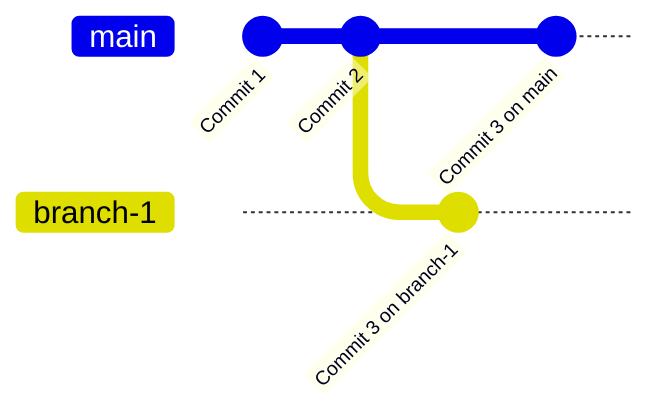

# Git Answers

### 1. What is the difference between git and GitLab?
- **Git** is a distributed version control system used to track changes in code, allowing multiple people to work on a project simultaneously.
- **GitLab** is a web-based Git repository manager that provides features for hosting Git repositories, code reviews, continuous integration/continuous delivery (CI/CD), issue tracking, and more. It enhances Git's functionalities by providing a UI, additional collaboration tools, and security features.

### 2. What is the difference between GitLab, GitHub, and BitBucket?
- **GitHub**: A cloud-based platform primarily for hosting Git repositories. It offers collaborative features like pull requests, issue tracking, and project management tools. It is widely used in open-source development.
- **GitLab**: Similar to GitHub but with a focus on DevOps and CI/CD tools. GitLab provides more extensive features like continuous integration, deployment pipelines, and issue tracking built-in, with an option to host your own instance.
- **BitBucket**: Another Git-based platform for version control that also integrates with CI/CD tools. BitBucket is popular with private repositories and has strong integration with other Atlassian products like Jira and Trello.

### 3. Why would I ever want to use Git, but not GitLab?
- You might want to use **Git** without GitLab if you don’t need a central server or collaborative features that GitLab provides. Git can be used locally on your computer for small projects or personal use, without the need for a remote server. If you don’t need to manage team workflows or CI/CD pipelines, Git alone may suffice.

### 4. What are the steps to update the GitHub server with some changes I made on my computer?

To update the **GitHub server** with the changes you've made locally, follow these steps:

1. **Stage Your Changes**  
   First, you need to stage the files that you've modified, added, or deleted. Staging files makes them ready to be committed to your local repository. You can stage individual files or all modified files:

   - To stage specific files:
     ```bash
     git add <filename>
     ```
     Replace `<filename>` with the name of the file you want to stage.

   - To stage all modified files in the repository:
     ```bash
     git add .
     ```

2. **Commit Your Changes**  
   After staging your changes, you need to commit them to your local repository. A commit includes your staged changes along with a descriptive message that explains the changes you made. 

   To commit your staged changes, use the following command:
   ```bash
   git commit -m "Descriptive commit message"


3. **Push the Changes to GitHub**  
   After committing your changes locally, the next step is to push those changes to the **GitHub server**. Pushing updates the remote repository with the changes made on your local machine.

   To push your changes to the corresponding branch on GitHub, use the following command:
   ```bash
   git push origin <branch-name>


### 5. What is a branch and why would I use one?

A **branch** in Git is a parallel version of the code that allows you to work on different tasks or features independently without affecting the main codebase. Branches are useful for isolating changes, collaborating with others, and experimenting with new ideas before merging them into the main project.

### 6. How could you visualize a branch with 3 commits, and then another branch that breaks off after the second commit and has a single commit?



#7. Git will detect a merge conflict when both branch1 and branch 2 have modified the same line in file.txt.
#example
git add file.txt
git commit -m "Initial commit"
git checkout -b branch1
git add file.txt
git commit -m "Change on branch1"
git checkout main
git checkout -b branch2
git add file.txt
git commit -m "Changes on branch2"
git checkout main
git merge branch1
git merge branch2

#8. Yes. Git allows you to track changes over time, and Git’s branching system is very useful for LaTeX documents.

#9. Not recommend. Word (.docx) and PowerPoint (.pptx) files are binary formats. Git works best with text-based files (like .txt, .md, .tex, etc.) and for binary files, resolving merge conflicts becomes extremely difficult since you cannot see the textual differences directly. 

#10. Merge conflicts may occur. If someone else has made changes and pushed them to the remote branch after you last pulled, then your local branch is behind the remote branch. When you try to push your changes, you will likely encounter an error, such as:
! [rejected]        your-branch -> your-branch (non-fast-forward)
error: failed to push some refs to 'https://github.com/your-repo'
hint: Updates were rejected because the tip of your current branch is behind
hint: its remote counterpart. If you want to integrate the remote changes,
hint: use 'git pull' before pushing again.

#11. It depends on whether the local changes conflict with remote changes or not. If so, Git will stop and mark the file as conflicted. We'll have to manually resolve the conflicts before proceeding. If not, Git will successfully merge the local changes with the changes from the remote branch, and the pull will create a new merge commit if necessary.

#12. Branching is a way to create a parallel version of your code within the same repository. Tipically used in teams. Forking is a way to create a personal copy of someone else's entire repository. Common in open-source projects.